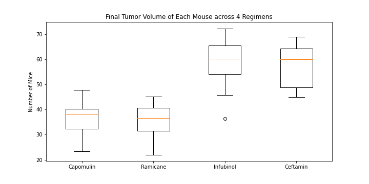

# matplotlib-challenge

# Written Analysis

1. What do add/not add into the data for the further analysis: As the two .csv files merged and discovered duplicates, there were duplicates in timepoints for the Mouse ID: g989; in addition, there was an inconsistency in tumor volume (mm3) for duplicate timepoints for the particular mouse. The decision to drop all the data associated with the Mouse ID (g989) was made due to the fact that the inconsistency in numeric data could decrease the accuracy of the outcome.  

2. Based on the , there is approx. 20-25% more mice in total numbers treated by Capomulin and Ramicane.

3. As for the analysis of the final tumor volume of each mouse across 4 regimens (Capomulin, Ramicane, Infubinol, and Ceftamin), determining the "final" timepoint was debatable since not every mouse survived through the entire timepoints (45). Because the writer (analyst) would point an argument that the final tumor volume does not necessarily mean of the latest timepoint (which is 45), each mouse's final timepoint and the tumor volume that's associated with that timepopint has a value to be considered in this analysis; therefore, the result of IQR and outliers reflect based on the dataset. Based on this perspective, there is one outlier for the Infubinol regimen. 