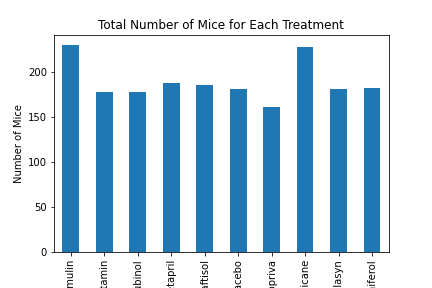

# matplotlib-challenge

# Written Analysis

1. What do add/not add into the data for the further analysis: As the two .csv files merged and discovered duplicates, there were duplicates in timepoints for the Mouse ID: g989; in addition, there was an inconsistency in tumor volume (mm3) for duplicate timepoints for the particular mouse. The decision to drop all the data associated with the Mouse ID (g989) was made due to the fact that the inconsistency in numeric data could decrease the accuracy of the outcome.  

2. Based on the , there is approx. 20-25% more mice in total numbers treated by Capomulin and Ramicane.

3. The pie plot distribution of female vs. male mice 